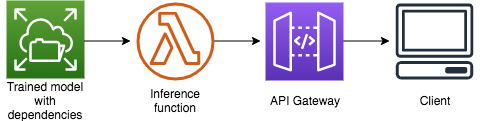

# Make inferences against large models with dependencies

## What are we building?


In this module we will use a pretrained model with large machine learning framework dependencies. we need a way to make inferences against it.  In this section we'll be building an HTTP rest endpoint (API Gateway) where we can POST JSON data against our model sitting on EFS.  A Lambda function will load the model, and make an inference directly against the model and return it in the HTTP response.

We will be doing model inferences *outside* of Amazon SageMaker.

## Why are we building it?
Once you have ordered a unicorn ride, you may want to take a picture of a unicorn as it arrives and validate it against the machine learning model for image classification. 

Why Lambda and EFS?  
As we offer the largest selection of unicorn for customers, but not all customers wants to validate the picture of a unicorn as the ride arrives. By hosting machine learning models on Lambda to make inferences, we can have a dynamic HTTP interface to make predections against a ML model classifying the image of unicorn without having to pay for seperate Amazon SageMaker endpoints. i.e. pay for AWS resources only when rider choose to validate the image of a unicorn.  

Deep Learning ML frameworks like TensorFlow, Pytorch etc are too large to fit into the 250 MB Lambda application artifact size limit along with the trained model. We also want to reduce the latencies for loading the ML model and large ML framework dependencies to make inferences on ML model. To address this, Lambda functions can now mount an Amazon Elastic File System (EFS). This is a scalable and elastic NFS file system stroing data within and across multiple Availability Zones (AZ) for high availability and durability. With this feature, now you can use Lambda to build data-intensive applications, and load larger libraries and models. This also enables you to share the ML framework and libraries across multiple lambda functions and ML models.

### Short Route: Deploy everything for me :see_no_evil:

We don't recommend this route unless you ran into a snag and are worried about completing the workshop on time.

**Time to complete:** 5-10 minutes.

<details>
<summary><strong>Deploy using AWS CloudFormation</strong></summary><p>

1. Navigate to your Cloud9 environment
1. Make sure you're in the correct directory first
    ```
    cd ~/environment/aws-serverless-workshops/MachineLearning/5_GinormousModels
    ```
1. Upload the inference code to Lambda
    ```
    aws s3 cp lambda-functions/ml_inferencefunction.zip s3://$bucket/code/ml_inferencefunction.zip
    ```
1. Create your resources
    ```
    aws cloudformation create-stack \
      --stack-name wildrydes-ml-mod3 \
      --parameters ParameterKey=DataBucket,ParameterValue=$bucket \
                   ParameterKey=DataProcessingExecutionRoleName,ParameterValue=$(aws cloudformation describe-stack-resources --stack-name wildrydes-ml-mod1 --logical-resource-id DataProcessingExecutionRole --query "StackResources[0].PhysicalResourceId" --output text) \
                   ParameterKey=TrainedModelPath,ParameterValue=$(aws s3 ls s3://$bucket/linear-learner --recursive | grep 'model' | cut -c 32-) \
      --capabilities CAPABILITY_NAMED_IAM \
      --template-body file://cloudformation/99_complete.yml
    ```
1. Set the API Gateway invoke URL as an environment variable.
    ```
    apigw=$(aws cloudformation describe-stacks \
      --stack-name wildrydes-ml-mod3 \
      --query "Stacks[0].Outputs[?OutputKey=='ApiGatewayInvokeURL'].OutputValue" \
      --output text)
    echo $apigw
    ```
1. Scroll down to the section on testing your API

</p></details>

</p></details>

### Long Route: Build the pipeline yourself :white_check_mark::metal:

**Time to complete:** 20-25 minutes.

### Step 1: Create an EFS file system along with EFS Access Point in a new VPC with public subnet

<details>
<summary><strong>Deploy using AWS CloudFormation</strong></summary><p>

1. Navigate to your Cloud9 environment
1. Make sure you're in the correct directory first
    ```
    cd ~/environment/aws-serverless-workshops/MachineLearning/5_GinormousModels
    ```
1. Create your resources
    This cloudformation template will create following AWS Resources:
    * A new VPC with public subnets.
    * Amazon Elastic File System (EFS) with provisioned throughput mode. Provisioned Throughput is designed to support applications that require higher dedicated throughput than the default Bursting mode and can be configured independently of the amount of data stored on the file system.
    * Ec2 instance which adds a task at boot time to mount the Amazon Elastic File System and download the following two items:
    * Download TensorFlow 2 Deep Learning libraries/Framework and store that on EFS.
    * Download Single Shot MultiBox Detector (SSD) pre-trained object detection model from TensorFlow Hub.

    ```
    aws cloudformation create-stack \
      --stack-name wildrydes-ml-mod5 \
      --capabilities CAPABILITY_NAMED_IAM \
      --template-body file://cloudformation/efs_99.yml
    ```
1. Monitor the status of your stack creation. **EITHER:**
    1. Go to [CloudFormation in the AWS Console](https://console.aws.amazon.com/cloudformation) **OR**
    1. Run the following command in Cloud9 until you get `CREATE_COMPLETE` in the output:
        ```
        # Run this command to verify the stack was successfully created. You should expect to see "CREATE_COMPLETE".
        # If you see "CREATE_IN_PROGRESS", your stack is still being created. Wait and re-run the command.
        # If you see "ROLLBACK_COMPLETE", pause and see what went wrong.
        aws cloudformation describe-stacks \
            --stack-name wildrydes-ml-mod5 \
            --query "Stacks[0].StackStatus"
        ```

**:heavy_exclamation_mark: DO NOT move past this point until you see CREATE_COMPLETE as the status for your CloudFormation stack**
1. Once the stack is completed, copy the output of the stack values to environment variables.
    ```
    efs_ap=$(aws cloudformation describe-stacks --stack-name wildrydes-ml-mod5 \
        --query "Stacks[0].Outputs[?OutputKey=='AccesspointARN'].OutputValue" --output text)
    ```
    ```
    lambda_sg=$(aws cloudformation describe-stacks  --stack-name wildrydes-ml-mod5 \
        --query "Stacks[0].Outputs[?OutputKey=='DefaultSecurityGroup'].OutputValue" --output text)
    ```
    ```
    mnt_subnet=$(aws cloudformation describe-stacks  --stack-name wildrydes-ml-mod5 --query "Stacks[0].Outputs[?OutputKey=='PrivateSubnetOne'].OutputValue" --output text;\
    echo ','; 
    aws cloudformation describe-stacks  --stack-name wildrydes-ml-mod5 --query "Stacks[0].Outputs[?OutputKey=='PrivateSubnetTwo'].OutputValue" --output text)
    ```
    ```
    mnt_subnet=\"${mnt_subnet}\"; mnt_subnet="$(echo -e "${mnt_subnet}" | tr -d '[:space:]')"
    ```
</p></details>

### Step 2: Check the downloaded framework libraries and model size

<details>
<summary><strong>Login into Ec2 Instance</strong></summary><p>

1. Open the [Ec2 console](https://console.aws.amazon.com/Ec2)
1. Select the c5.large instance which is running with Name tensorflow-for-serverless-inference-cfn-ec2.
1. Select the option "Connect" and using Ec2 Instance Connect login to your Ec2 Instance. Amazon EC2 Instance Connect provides a simple and secure way to connect to your Linux instances using Secure Shell (SSH).
1. Once you are connected to Ec2 instance using SSH, execute the following command to check the machine learning model size. Note the model size is greater then ~60 MB
    ```
    du -sh /home/ec2-user/efs/model
    ```
1. Execute the following command to check the TensorFlow 2 Framework size. Note the Framework dependencies size is greater than ~1.2 GB
    ```
    du -sh /home/ec2-user/efs/tensorflow
    ```
1. Exit the SSH session
</p></details>

### Step 3: Upload Inference Function Zip

<details>
<summary>Upload <code>lambda-functions/ml_inferencefunction.zip</code> to <code>YOUR_BUCKET_NAME/code</code>. (Expand for detailed instructions)</summary><p>

1. Navigate to your Cloud9 environment
1. Run the following command to upload the Lambda function for inference
    ```
    # Command should be ran from /home/ec2-user/environment/aws-serverless-workshops/MachineLearning/5_GinormousModels in your cloud 9 environment
    cd ~/environment/aws-serverless-workshops/MachineLearning/5_GinormousModels

    # Run this command to upload the ride data
    aws s3 cp lambda-functions/ml_inferencefunction.zip s3://$bucket/code/ml_inferencefunction.zip

    # Run this command to verify the file was uploaded (you should see the file name listed)
    aws s3 ls s3://$bucket/code/
    ```
</p></details>

### Step 4: Create Lambda function and API Gateway skeletons
At this point, we have downloaded pre-trained model on EFS along with its framework dependencies.  Now, we're ready to load the model into Lambda at runtime and make inferences against the model using Lambda EFS integration. The Lambda function that will make inferences is hosted behind an API Gateway that will accept POST HTTP requests.
Create a Lambda function for Model Inferences named <code>ml_inferencefunction</code> and a REST API Gateway instance. Read the CloudFormation template if you need help figuring it out.

OR

<details>
<summary>Create a CloudFormation stack from <code>cloudformation/5_lambda_function.yml</code> named <code>wildrydes-ml-mod5-inf</code>. (Expand for detailed instructions)</summary><p>

1. Navigate to your Cloud9 environment
1. Run the following command to create your resources:
    ```
    # Command should be ran from /home/ec2-user/environment/aws-serverless-workshops/MachineLearning/3_Inference in your cloud 9 environment
    cd ~/environment/aws-serverless-workshops/MachineLearning/3_Inference

    aws cloudformation create-stack \
      --stack-name wildrydes-ml-mod5-inf \
      --template-body file://cloudformation/5_lambda_function.yml \
      --parameters  \
        ParameterKey=SecurityGroupIds,ParameterValue=${lambda_sg} \
        ParameterKey=SubnetIDs,ParameterValue=${mnt_subnet} \
        ParameterKey=AccessPointARN,ParameterValue=${efs_ap} \
        ParameterKey=DataBucket,ParameterValue=${bucket} \
      --capabilities CAPABILITY_NAMED_IAM
</p></details>

### Step 4: Wire up API Gateway
The last thing we need to connect is the HTTP API Gateway to your `ModelInferenceFunction`

<details>
<summary>1. Update the <code>ModelInferenceApi</code> API Gateway root resource to proxy requests to your <code>ModelInferenceFunction</code>. (Expand for detailed instructions)</summary><p>

1. Open the [API Gateway console](https://console.aws.amazon.com/apigateway)
1. Click `ModelInferenceApi`
1. Select the root `/` resource
1. Click **Actions** > **Create Method**
1. Select `ANY` in the dropdown
1. Click the checkbox next to it
1. Verify `Lambda Function` is selected as the **Integration type**
1. Check the box next to **Use Lambda Proxy integration** so we get all request details
1. Select your `ModelInferenceFunction` in the **Lambda Function** dropdown. If it is not a dropdown, start typing 'inference' to find and select your function.
1. Click **Save**
1. Click **OK** to the permissions dialogue box
</p></details>

<details>
<summary>2. Deploy your API Gateway. (Expand for detailed instructions)</summary><p>

1. Navigate to the `ModelInferenceApi`. If not already there:
    1. Open the [API Gateway console](https://console.aws.amazon.com/apigateway)
    1. Click `ModelInferenceApi`
    1. Select the root `/` resource
1. Click **Actions** > **Deploy API**
1. Select the `prod` stage if it exists. If not,
    1. Select `[New Stage]` for **Deployment Stage**
    1. Type `prod` for **Stage name**
1. Click **Deploy**
</p></details><br>

 :metal: Take note of your **Invoke URL** if you are figuring this out on your own. You'll use it as an environment variable below i.e.$apigw

## Testing your API

1. Navigate to your Cloud9 environment
1. Run the following command to call your model:
    ```
    curl -d '{ "url": "https://images.pexels.com/photos/310983/pexels-photo-310983.jpeg?auto=compress&cs=tinysrgb&dpr=2&h=650&w=940"}'\
     -H "Content-Type: application/json" -X POST $apigw
    ```
1. _Optional_: You can also test the Lambda function by putting using the test API UI in the API Gateway console.

What did your `curl` command return?  What's this mean?

Lets look at the `curl` command first:

    curl -d '{ "url": "https://images.pexels.com/photos/310983/pexels-photo-310983.jpeg?auto=compress&cs=tinysrgb&dpr=2&h=650&w=940"}'
      -H "Content-Type: application/json"
      -X POST STAGE_URL

This is asking our deployed model to detect if the input image provided in the URL contains horse class? The object detection pre-trained model has been trained
to detect various objects and hence it detects there is no horse in the image. Lambda function returns "Unable to validate Unicorn" if no horse class is detected.

What happens when we provide an image of one of our Unicorn when our ride arrives?
```
curl -d '{ "url": "http://www.wildrydes.com/images/wr-unicorn-two.png?auto=compress&cs=tinysrgb&dpr=2&h=650&w=940"}'
      -H "Content-Type: application/json"
      -X POST STAGE_URL
```

## Next step:
Make sure you [clean up](../99_Cleanup) any resources you created.
